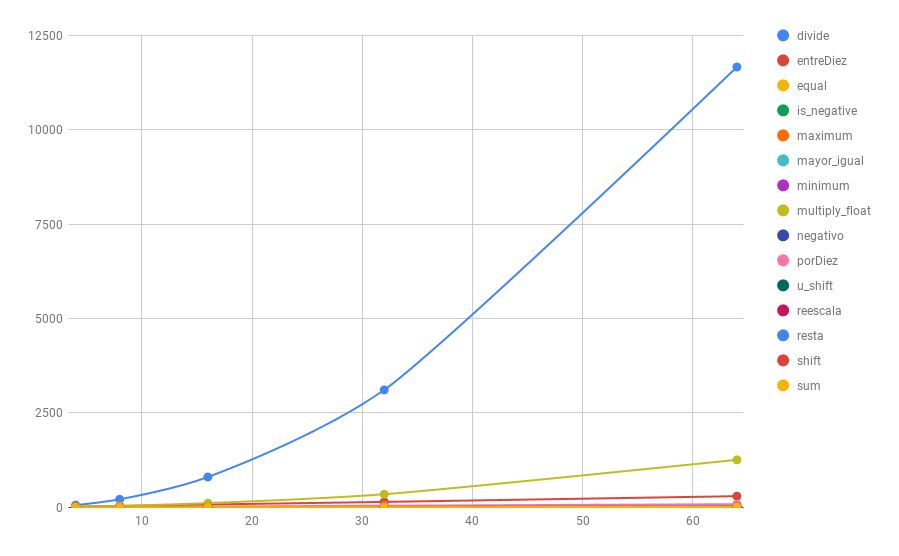

# TFHE Math

Math library for TFHE.

## Description

Library with mathematic operations for working with the HE library TFHE. By now, it provides these functionalities:

- Arithmetic operations in package `tfhe-math/arithmetic`

It has been developed in the context of a university work, concretely my Master's Thesis.

## Dependencies

- `tfhe` ([https://tfhe.github.io/tfhe/](https://tfhe.github.io/tfhe/)) and all its dependencies

## Installation

To install `tfhe-math` we will need to have compiled `tfhe`. First, download the code, and enter in its folder for configuring it:

```console
$ git clone git@gitlab.com:junquera/tfhe-math.git
$ cd tfhe-math
```

Edit the file `src / Makefile` and specify the value of the variable` TFHE_PREFIX` (the path where `tfhe` library and all its` .h` files are). After saving, go into the folder `src` and run` make`. It will make a folder called `prefix` in the project's root with all necessary files for using the library in other projects.

`make install` will copy the `prefix`'s files in the appropriate path for using the library anywhere in the system.

## Usage


## Benchmarking

Function benchmarking With 64bit numbers:

| Function    | Logic gates | Estimated time | Real time |
|------------:|:-----------:|:--------------:|:---------:|
| compare_bit | 2           | 0,04           | 0         |
| equal       | 128         | 2,56           | 3         |
| is_negative | 1           | 0,02           | 0         |
| minimum     | 388         | 7,76           | 14        |
| add_bit     | 5           | 0,1            | 0         |
| sum         | 320         | 6,4            | 8         |
| negativo    | 192         | 3,84           | 8         |
| resta       | 512         | 10,24          | 16        |
| multiply    | 46826       | 936,52         | 1257      |
| mayor_igual | 128         | 2,56           | 4         |
| shiftl      | 771         | 15,42          | 19        |
| u_shiftl    | 129         | 2,58           | 0         |
| divide      | 85776       | 1715,52        | 11662     |    

Execution times grows with the numbers size like this:




## Acknowledgments

To Phd. Alfonso Muñoz ( @mindcrypt ), which was my mentor during the development of this work.

Thank you very much!

## Cite

```
@misc{tfhe-math,
    title = {{TFHE} {Math} Library},
    howpublished = {\url{https://gitlab.com/junquera/tfhe-math}},
    author  = {Javier Junquera},
    month = august,
    year = 2019,
    Note = {},
    key = {TFHE-MATH}
}
```

## License

```
Copyright 2019  Javier Junquera Sánchez <javier@junquera.xyz>

Licensed under the Apache License, Version 2.0 (the "License");
you may not use this file except in compliance with the License.
You may obtain a copy of the License at

	http://www.apache.org/licenses/LICENSE-2.0

Unless required by applicable law or agreed to in writing, software
distributed under the License is distributed on an "AS IS" BASIS,
WITHOUT WARRANTIES OR CONDITIONS OF ANY KIND, either express or implied.
See the License for the specific language governing permissions and
limitations under the License.
```
